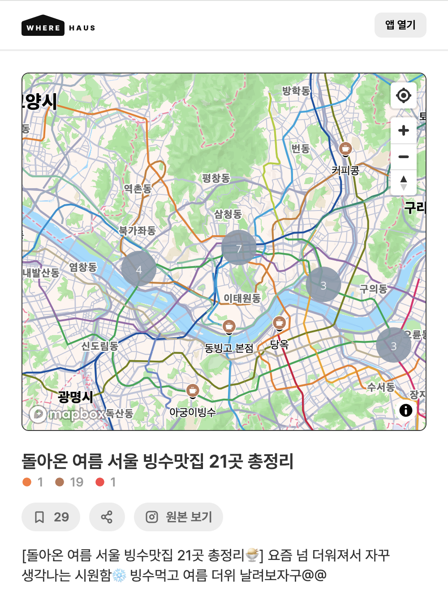
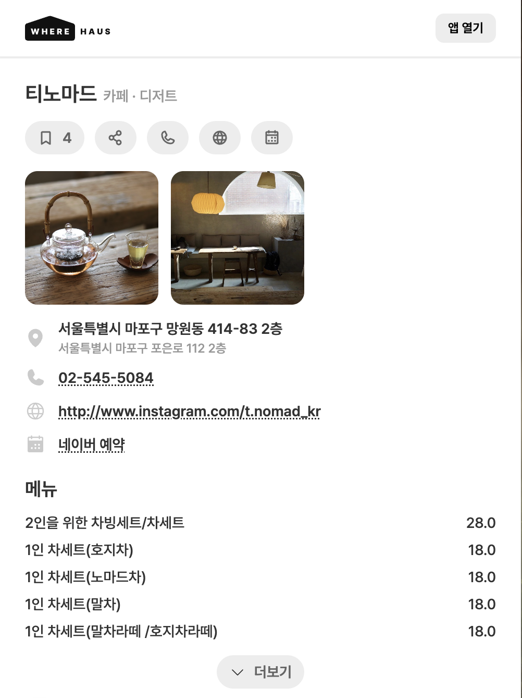
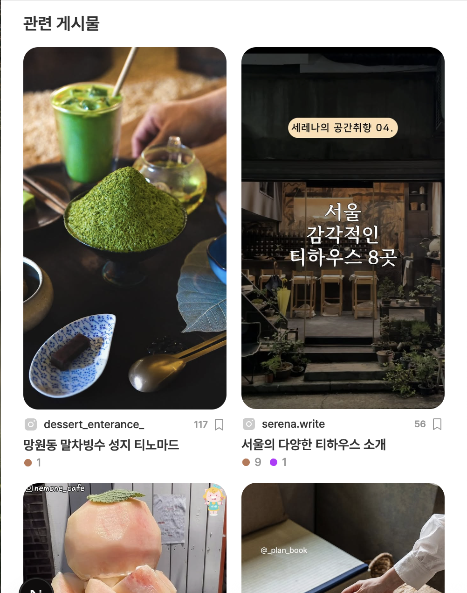

# Frontend Portfolio

## 지도 기반 장소 공유 서비스  
*(회사 상용 서비스 · 프론트엔드 단독 개발)*

---

### 🔍 프로젝트 개요
- 사용자가 **지도를 기반으로 장소를 탐색하고 공유**할 수 있는 웹 서비스
- 실제 운영 중인 **회사 상용 제품**

---

### 🙋‍♂️ 나의 역할
- **프론트엔드 단독 개발**
- 디자이너가 제공한 **Figma 시안 기반 UI 구현**
- 기능 설계부터 구현, 성능 개선, 유지보수까지 전반 담당

---

### 🛠 사용 기술
- **Next.js (App Router)**
- **TypeScript**
- **Tailwind CSS**
- **Mapbox**
- REST API 연동

---

### ⭐ 핵심 기능
- 지도 기반 장소 렌더링 및 마커 표시
- 다수 장소에 대한 **클러스터 처리**
- 장소 카드 리스트 및 상세 화면 구현
- 모바일 화면 중심 UI/UX 구성

---

### 📷 화면 예시
> ※ 실제 서비스 화면이며, 민감 정보는 비식별 처리했습니다.

| 지도 메인 화면 | 장소 상세 화면 |
|----------------|----------------|
|  |  |
| 관련 게시물 화면 |
|  |

- 지도 기반으로 장소를 탐색하는 메인 화면  
- 선택한 장소의 상세 정보를 확인하는 화면

---
